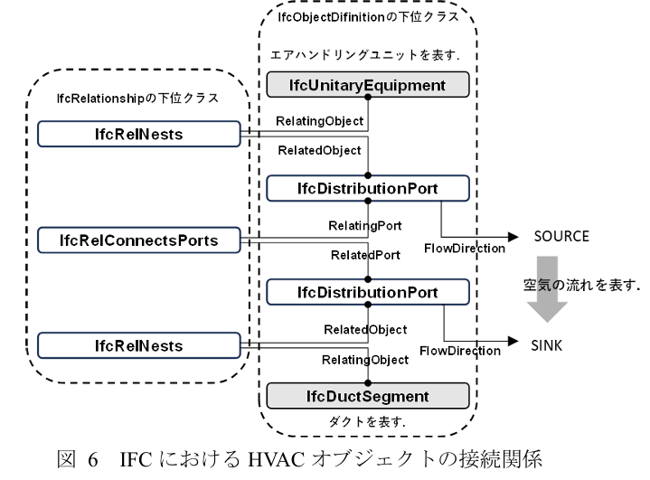

# Program Design: Multi-Stage IFC-to-Brick Transformation Pipeline

1. Introduction
The objective of this program design is to establish a vendor-neutral, automated pipeline that transforms static BIM data (IFC) into a dynamic, high-fidelity knowledge graph (Brick). Due to the discrepancy in information granularity—where typical IFC models lack the specific operational semantics required by Brick—the conversion is executed through a structured, three-stage process. This methodology leverages BDNS for standardized nomenclature and bsDD as a semantic hub to ensure interoperability and machine-readability.

2. Multi-Stage Transformation Process
### Stage 1: Semantic Alignment (Syntax & Classification Mapping)
The first stage establishes the initial semantic grounding of IFC entities by mapping them to Brick classes using BDNS abbreviations embedded directly within the IFC model.
In this simplified case study, BDNS tags are manually inserted into IFC elements in advance, thereby eliminating the need for bsDD lookup at this time. (to be updated in the future)
• Mechanism: The system extracts BDNS abbreviations from IFC attributes such as IfcRoot.Name, IfcRoot.Description, or property sets. These BDNS tags (e.g., TEMP_SENS, VAV) are used as the primary key for determining Brick class candidates.
• Outcome: A one‑to‑one or many‑to‑one mapping that assigns an IFC entity to its corresponding Brick class. For example, an IfcSensor with a BDNS tag TEMP_SENS is initially classified as brick:Temperature_Sensor.

### Stage 2: Object generation
Generate the granular Brick point objects and their metadata directly from an external CSV list, then attach them to Stage 1 equipment via brick:hasPoint. 
Utilize the BDNS abbreviation to identify the corresponding device, room, etc.

### Stage 3: Logical Topology Synthesis (Relationship Reasoning)
The purpose of Stage 3 is to infer the functional, spatial, and logical topology of building systems from IFC relationship entities and to synthesize them into a  knowledge graph.
Because IFC encodes connectivity and containment implicitly through its relationship classes, this stage performs reasoning to derive explicit Brick predicates such as brick:hasLocation, brick:feeds, and brick:hasPoint.

• Relationship Extraction:
    ◦ IfcRelContainedInSpatialStructure is translated to brick:hasLocation to link equipment to rooms.
    ◦ IfcRelAssignsToGroup or internal data connectors(IfcRelNests,IfcRelConnectsPorts, etc.) are analyzed to construct brick:feeds (e.g., VAV feeds an HVAC Zone) and brick:hasPoint (linking the equipment to its monitoring points).(by my work)

## Overall Pipeline Architecture (Inputs and Outputs)

### Input
・*.ifc（IFC4.3）
Static BIM models serving as the primary source of spatial hierarchy and equipment definitions
・BDNS mapping resources
At minimum, a lookup table aligning BDNS abbreviations with candidate Brick classes together with normalization rules and regular expressions

#### Note on IFC Input and BDNS Tagging
In a full‑scale deployment scenario, IFC models are expected to receive BDNS annotations through a semi‑automated workflow that leverages the buildingSMART Data Dictionary (bSDD) API. However, for the purpose of the present case study, this automated enrichment step is intentionally omitted. Instead, the IFC input models used here already contain manually assigned BDNS tags embedded within attributes such as IfcRoot.Name, IfcClassificationReference or IfcPropertySet values. This simplification isolates the semantic mapping logic from the challenges of automated vocabulary retrieval and ensures that the evaluation focuses solely on the correctness of the IFC‑to‑Brick transformation pipeline, rather than the upstream tagging workflow.

### Output
・ Brick Model (Turtle or JSON‑LD)
A generated semantic representation of the building expressed as building_brick.ttl
・ Transformation Provenance
A machine‑readable record identifying which IFC elements produced which Brick entities
・ Validation Reports
IDS verification results for IFC input quality

### IFC‑Ingestor
Parse IFC4.3 models and extract candidate entities and relationships required by downstream mapping, including spatial containment and port connectivity.

### BDNS‑Extractor
Locate and normalize BDNS abbreviations embedded in IFC, prioritizing attributes where such tags are likely to be stored in this case study.

### Class‑Mapper
Map normalized BDNS tags to Brick class candidates and select the final Brick class.

### points_csv_ingestor

### points_linker

### topology_reasoner

### rdf_writer